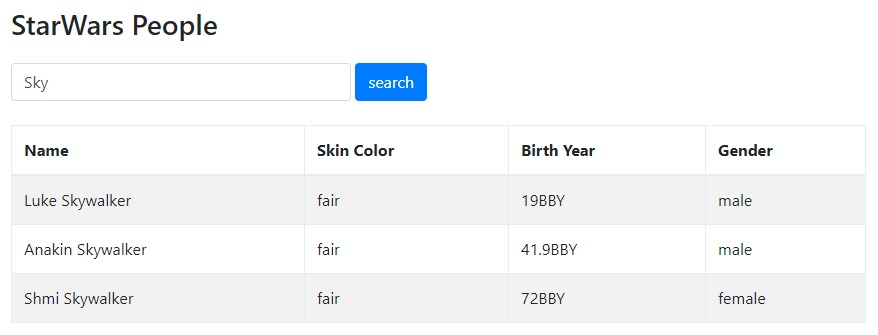

# Star Wars API: People Search

## Exercise

Create a class that sends a request to the [Star Wars API](https://swapi.co/), to search for people with a matching name.   Use the "people" endpoint of the API.

The search results should be written to the table and don't forget to remove the results of your last search, before adding new rows.

## Mockup

Your result could look like the following demo, that shows all needed parts of the application. Feel free to add some more creative styling, but please get it working first.

## Template

https://codepen.io/noreading/pen/JpZxQz/

## Solution

https://codepen.io/noreading/pen/OOBdNY/